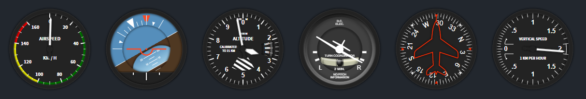

<div align="center">
  <h1>Interfaz Gráfica de Horizonte Artificial y Giroscopio Direccional</h1>
  <h3>Simulación en tiempo real usando MPU6050 y MicroPython</h3>
  
</div>

---

Este proyecto simula en tiempo real un horizonte artificial y un giroscopio direccional, obteniendo datos de un sensor MPU6050.

## 🚀 ¿Cómo funciona?

El código está implementado en MicroPython sobre una Raspberry Pi W. Utiliza un servidor local con [microdot](https://github.com/miguelgrinberg/microdot) para tomar mediciones de los ejes X, Y y el acelerómetro del MPU6050, actualizando los datos en una interfaz gráfica web.

La interfaz gráfica se basa en el excelente trabajo de [teocci/js-module-flight-indicators](https://github.com/teocci/js-module-flight-indicators).

---

## 📦 Instalación y uso de Flight Indicators

Para usar Flight Indicators JS, importa los archivos `css` y `js` en tu archivo HTML:

```html
<link rel="stylesheet" type="text/css" href="css/flight-indicators.css" />
<script src="js/flight-indicator.js"></script>
```

O bien, para módulos:

```js
import FlightIndicators from "./module-flight-indicators.js";
```

### Instanciación

Crea un `<div>` para colocar el indicador:

```html
<div id="attitude"></div>
```

Luego, cuando el `div` esté listo en el DOM, crea una instancia de `FlightIndicators`:

```js
const attitudeElement = document.querySelector("#attitude");
const attitude = new FlightIndicators(
  attitudeElement,
  FlightIndicators.TYPE_ATTITUDE
);
```

Tipos disponibles: `airspeed`, `altimeter`, `attitude`, `heading`, `vertical`, `coordinator`.

```js
TYPE_HEADING = "heading";
TYPE_AIRSPEED = "airspeed";
TYPE_ALTIMETER = "altimeter";
TYPE_VERTICAL_SPEED = "vertical";
TYPE_ATTITUDE = "attitude";
TYPE_TURN_COORDINATOR = "coordinator";
```

---

## ⚙️ Opciones de configuración

Puedes modificar la configuración inicial usando el parámetro `options`:

```js
const options = {
  size: 200, // Tamaño en píxeles
  roll: 0, // Ángulo de roll
  pitch: 0, // Ángulo de pitch
  turn: 0, // Rotación del coordinador
  heading: 0, // Rumbo
  verticalSpeed: 0, // Velocidad vertical
  airspeed: 0, // Velocidad de aire
  altitude: 0, // Altitud
  pressure: 1000, // Presión (hPa)
  hideBox: true, // Ocultar caja exterior
  imagesDirectory: "img/", // Carpeta de imágenes
};
```

---

## 🔄 Actualización en tiempo real

Puedes actualizar los indicadores en tiempo real usando los siguientes métodos:

```js
attitude.updateRoll(30); // Cambia el roll a 30 grados
```

Otros métodos disponibles:

```js
indicator.updateRoll(roll);
indicator.updatePitch(pitch);
indicator.updateCoordinator(turn);
indicator.updateHeading(heading);
indicator.updateVerticalSpeed(vSpeed);
indicator.updateAirSpeed(speed);
indicator.updateAltitude(altitude);
indicator.updatePressure(pressure);
indicator.resize(size);
indicator.showBox();
indicator.hideBox();
```

---

<div align="center">
  
</div>
